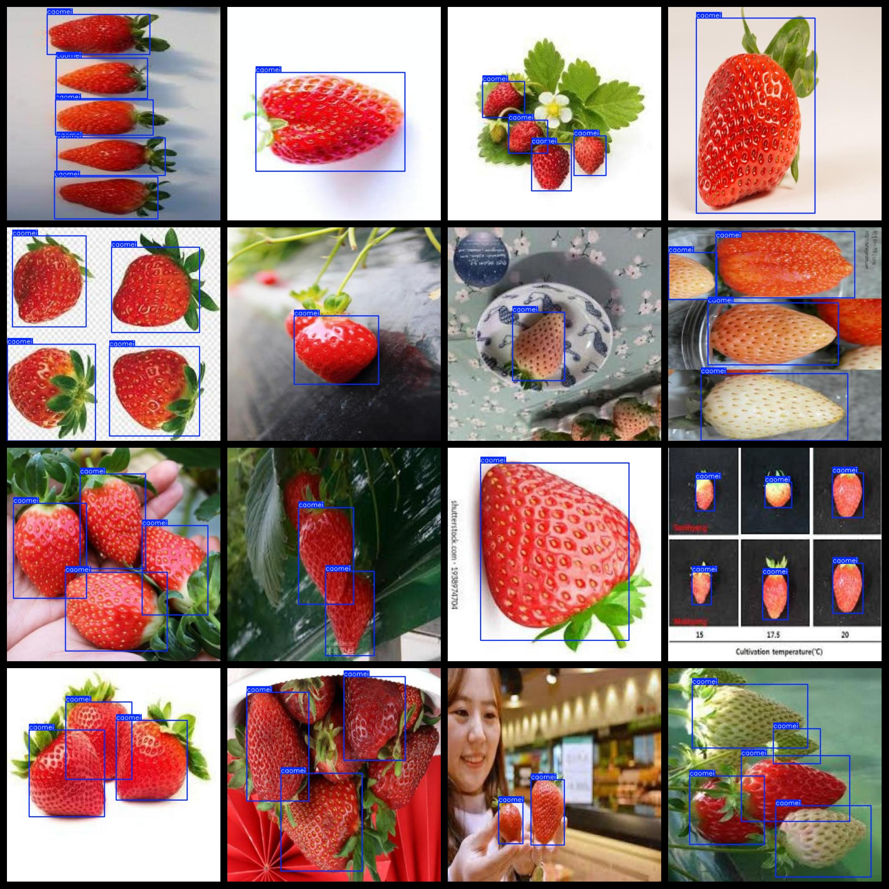
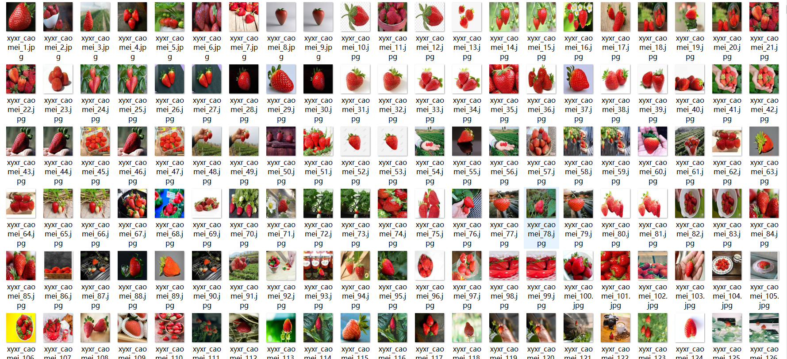

# [Object Detection] Strawberry Dataset 4888 imagesVOC+YOLO format

Dataset Description:

Data Introduction: The images are all square box annotations collected from strawberry pictures for deep learning object detection, including YOLO and VOC two kinds of annotation formats.

Dataset format: Pascal VOC format + YOLO format (the txt file does not contain the split path, it only contains jpg images and corresponding VOC format xml files and yolo format txt files)

Number of images (number of jpg files): 4888

Number of annotations (number of xml files): 4888

Number of annotations (number of txt files): 4888

Number of categories: 1

Annotation class names: ["caomei"]

Number of boxes labeled in each category:

caomei frame count = 13951

Total boxes: 13951

Use the labeling tool: labelImg

Rules for annotation: Draw a rectangle around the category.

## Images

---

Here is a pay link on Stripe (https://buy.stripe.com/3cs8yP7sY87d0vu9AB). Please contact me lonlonago@foxmail.com after funding $89, and I will send you a complete data files, thank you!

